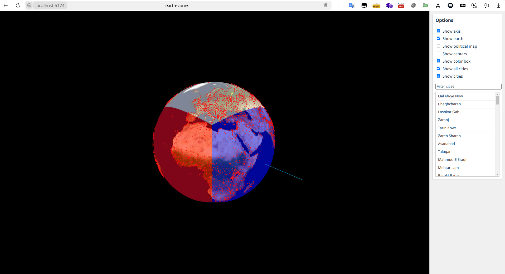

# Earth Zones

Port of the C++ project `appEarth` to React + Three.js.

Demo: https://hightemp.github.io/earth-zones/

## Features
- 3D Earth model with custom shader (colored zones by axis).
- Political map overlay.
- Loading and displaying cities from CSV.
- UI panel for layer control and city search.

## Run
1. `npm install`
2. `npm run dev`

## Build
`npm run build` (output in `docs` folder)

## Screenshots

